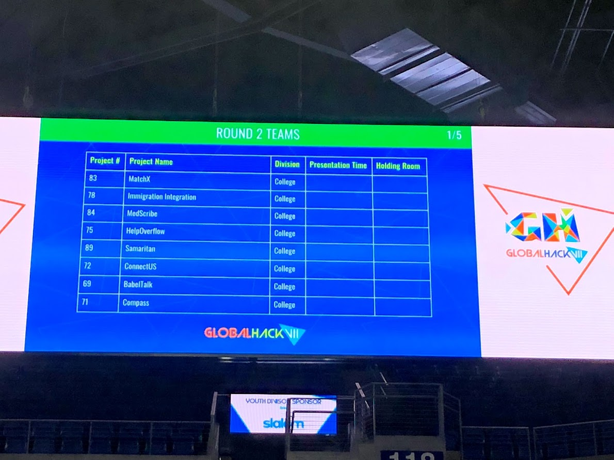

Globalhack 7 was a crazy weekend. Packed into a stadium with hundreds of contestants, our team fought off sleep in order to try and create something awesome for immigrants and refugees within the US.

What we came up with was an idea called [Help Overflow](https://github.com/giraffesyo/help2behelped). The project basically allows immigrants to trade favors for reputation or favor points. These favor points can then be used to get their own favors done. This type of system is ideal for an immigrant community because of a couple reasons:

1. Immigrants are unlikely to extra have money to pay for services
2. Immigrants can be skilled individuals, but not know anyone in their community

By performing free favors for someone, they are able to grow their personal network in the community, their reputation as a trustworthy person, and also get something back in return that can be of value to them (the favor points). 

The implementation of this over a weekend was tough and we mostly got the idea and some of the interface fleshed out. While we did not make it to the final round, it was very exciting to see our names pop up when we made it into the second round and had the opportunity to defend our project in front of a second set of judges.

I hope to participate in more Hackathons in the future, this was an awesome networking opportunity and I had a ton of fun!

